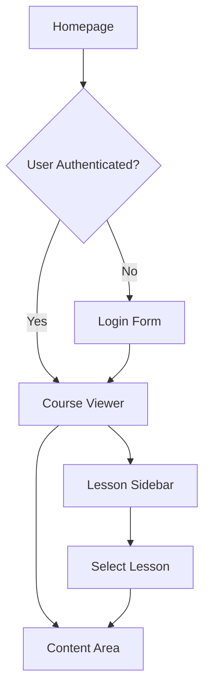

## 1. Product Overview
A minimal dark-themed online course platform that allows users to access course content after authentication. The platform features a clean homepage with course details and a login system, followed by an authenticated learning interface with lesson navigation and content display.

Target users are students seeking a distraction-free learning environment with easy access to course materials including markdown-formatted lessons and embedded YouTube videos.

## 2. Core Features

### 2.1 User Roles
| Role | Registration Method | Core Permissions |
|------|---------------------|------------------|
| Student | Email registration | View course homepage, access lessons after login |
| Guest | No registration | View course homepage only |

### 2.2 Feature Module
The online school platform consists of the following main pages:
1. **Homepage**: Course overview, lesson preview, login button
2. **Course Viewer**: Sidebar lesson navigation (30% width), main content area (70% width) with markdown rendering and YouTube video embedding

### 2.3 Page Details
| Page Name | Module Name | Feature description |
|-----------|-------------|---------------------|
| Homepage | Course Header | Display course title and brief description |
| Homepage | Course Overview | Show course details, lesson count, and preview content |
| Homepage | Login Section | Provide login button and authentication form |
| Course Viewer | Lesson Sidebar | List all lessons (e.g., 10 lessons) with clickable navigation |
| Course Viewer | Content Area | Render markdown content and embed YouTube videos |
| Course Viewer | Progress Indicator | Show current lesson position and navigation controls |

## 3. Core Process
Users first encounter the homepage where they can view course details and lesson previews. Guest users can browse the course information but must log in to access the actual content. After successful authentication, users are redirected to the course viewer interface where they can navigate through lessons using the left sidebar. The main content area displays the selected lesson's markdown-formatted content and any embedded YouTube videos.

## 4. User Interface Design

### 4.1 Design Style
- **Primary Color**: Deep charcoal (#1a1a1a) for background
- **Secondary Color**: Electric blue (#3b82f6) for accents and buttons
- **Text Color**: Light gray (#e5e5e5) for readability
- **Button Style**: Rounded corners with subtle hover effects
- **Font**: Modern sans-serif (Inter or similar), 16px base size
- **Layout Style**: Clean card-based design with minimal borders
- **Icons**: Simple line icons with consistent stroke weight

### 4.2 Page Design Overview
| Page Name | Module Name | UI Elements |
|-----------|-------------|-------------|
| Homepage | Course Header | Centered title with large font (32px), subtle gradient background |
| Homepage | Course Overview | Card-based layout with course description, lesson count badge |
| Homepage | Login Button | Blue rounded button with white text, positioned prominently |
| Course Viewer | Lesson Sidebar | Dark sidebar with lesson list, active lesson highlighted in blue |
| Course Viewer | Content Area | Light text on dark background, markdown formatting, embedded video player |

### 4.3 Responsiveness
Desktop-first design approach with mobile adaptation. The 30/70 split layout maintains proportions on larger screens, with the sidebar becoming collapsible on tablets and stacking vertically on mobile devices. Touch interactions are optimized for lesson navigation and video controls.