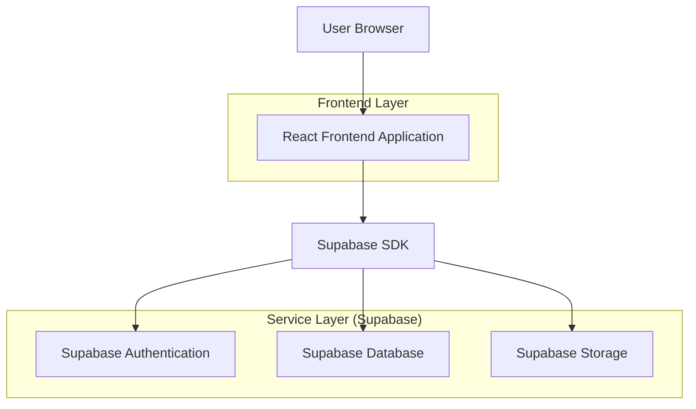
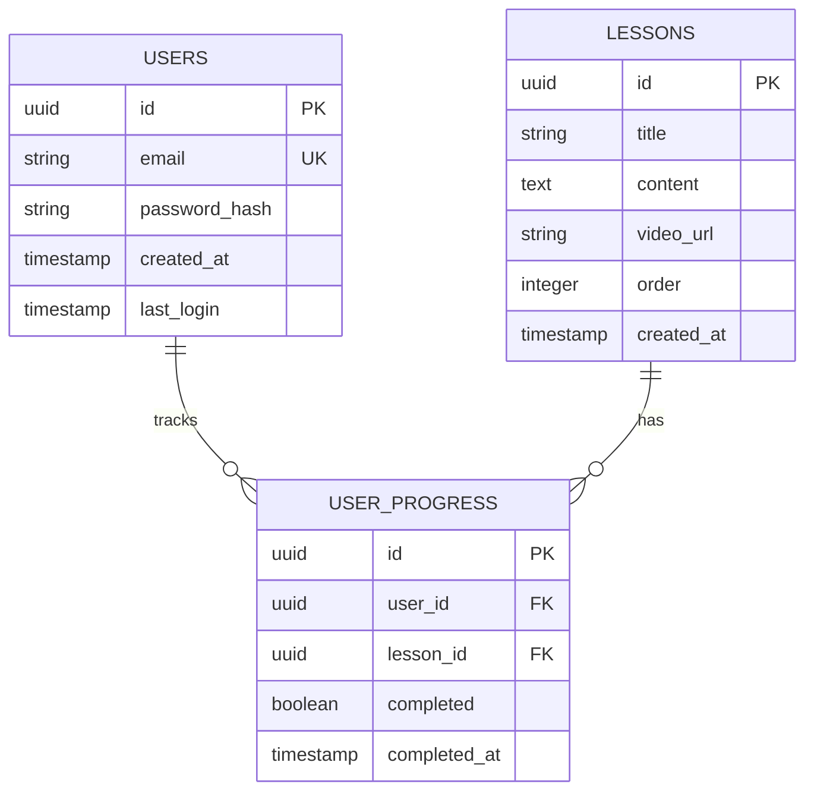

## 1. Architecture Design



## 2. Technology Description
- Frontend: React@18 + tailwindcss@3 + vite
- Initialization Tool: vite-init
- Backend: Supabase (Authentication, Database, Storage)
- Markdown Rendering: react-markdown + remark-gfm
- Video Embedding: Custom YouTube embed component

## 3. Route Definitions
| Route | Purpose |
|-------|---------|
| / | Homepage, displays course overview and login |
| /login | Login page, handles user authentication |
| /course | Course viewer, requires authentication |
| /course/:lessonId | Specific lesson content with markdown and videos |

## 4. API Definitions

### 4.1 Authentication API
```
POST /auth/v1/token
```

Request:
| Param Name| Param Type  | isRequired  | Description |
|-----------|-------------|-------------|-------------|
| email     | string      | true        | User email address |
| password  | string      | true        | User password |

Response:
| Param Name| Param Type  | Description |
|-----------|-------------|-------------|
| access_token | string   | JWT token for authenticated requests |
| user      | object      | User profile information |

### 4.2 Course Content API
```
GET /rest/v1/lessons
```

Response:
| Param Name| Param Type  | Description |
|-----------|-------------|-------------|
| id        | number      | Lesson identifier |
| title     | string      | Lesson title |
| content   | string      | Markdown content |
| video_url | string      | YouTube video URL (optional) |
| order     | number      | Lesson display order |

## 5. Data Model

### 5.1 Data Model Definition


### 5.2 Data Definition Language

Users Table
```sql
CREATE TABLE users (
    id UUID PRIMARY KEY DEFAULT gen_random_uuid(),
    email VARCHAR(255) UNIQUE NOT NULL,
    password_hash VARCHAR(255) NOT NULL,
    created_at TIMESTAMP WITH TIME ZONE DEFAULT NOW(),
    last_login TIMESTAMP WITH TIME ZONE
);

-- Grant permissions
GRANT SELECT ON users TO anon;
GRANT ALL PRIVILEGES ON users TO authenticated;
```

Lessons Table
```sql
CREATE TABLE lessons (
    id UUID PRIMARY KEY DEFAULT gen_random_uuid(),
    title VARCHAR(255) NOT NULL,
    content TEXT NOT NULL,
    video_url VARCHAR(500),
    "order" INTEGER NOT NULL,
    created_at TIMESTAMP WITH TIME ZONE DEFAULT NOW()
);

-- Grant permissions
GRANT SELECT ON lessons TO anon;
GRANT ALL PRIVILEGES ON lessons TO authenticated;

-- Sample data
INSERT INTO lessons (title, content, video_url, "order") VALUES
('Introduction to Course', '# Welcome\\n\\nThis is the first lesson...', 'https://youtube.com/watch?v=abc123', 1),
('Advanced Concepts', '# Deep Dive\\n\\nIn this lesson we explore...', null, 2);
```

User Progress Table
```sql
CREATE TABLE user_progress (
    id UUID PRIMARY KEY DEFAULT gen_random_uuid(),
    user_id UUID REFERENCES users(id) ON DELETE CASCADE,
    lesson_id UUID REFERENCES lessons(id) ON DELETE CASCADE,
    completed BOOLEAN DEFAULT false,
    completed_at TIMESTAMP WITH TIME ZONE,
    created_at TIMESTAMP WITH TIME ZONE DEFAULT NOW()
);

-- Grant permissions
GRANT ALL PRIVILEGES ON user_progress TO authenticated;

-- Create indexes
CREATE INDEX idx_user_progress_user_id ON user_progress(user_id);
CREATE INDEX idx_user_progress_lesson_id ON user_progress(lesson_id);
```